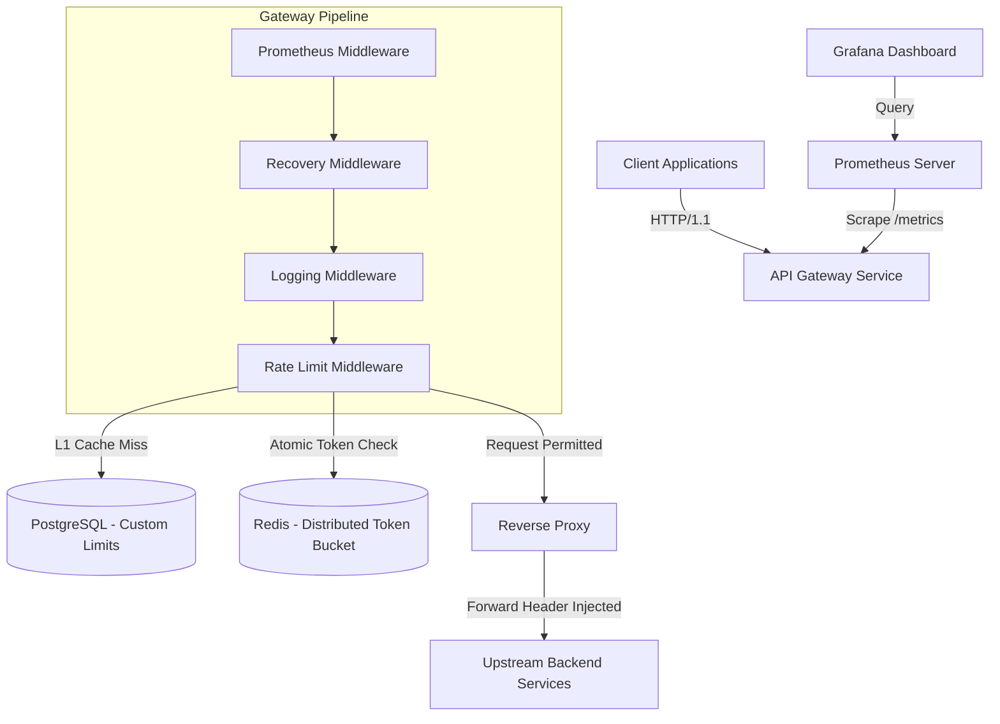

# High-Throughput API Gateway & Distributed Rate Limiter

A production-grade, distributed token bucket rate limiting reverse proxy built with Go. Designed for high-throughput microservices, it supports dynamic PostgreSQL limits with L1 in-memory caching, distributed atomic Redis Lua state management, RFC 7807 problem details error responses, standard RFC rate limit headers, and complete Prometheus/Grafana observability.

---

## Architecture & Request Flow



---

## Key Features & Engineering Highlights

* **Multi-Tiered Rate Limiting:**
    * **L1 Cache:** Thread-safe, in-memory TTL map eliminates database roundtrips on hot API routes.
    * **L2 Storage:** PostgreSQL persists dynamic, per-client custom rate limit definitions.
    * **Distributed Synchronization:** Atomic Redis Lua scripts maintain precise token balances across multi-instance gateway deployments.
* **Standards Compliance:**
    * **RFC Rate Limit Headers:** Automatically injects `X-RateLimit-Limit`, `X-RateLimit-Remaining`, and `X-RateLimit-Reset` into HTTP responses.
    * **RFC 7807 Problem Details:** Emits standard `application/problem+json` payloads for `429`, `500`, `502`, and `504` errors.
* **Observability & Metrics:** Built-in Prometheus scraping endpoint (`/metrics`) and auto-provisioned Grafana dashboards tracking RPS, Latency (p50/p95/p99), and Drop Rates.
* **Cloud-Native Deployment:** Hardened non-root Distroless Docker images (`gcr.io/distroless/static-debian12`) with zero-dependency Go healthcheck probes (`/app/gateway -healthcheck`).

---

## Performance Benchmarks

### 1. Go Native Microbenchmarks (`go test -bench`)

> **Hardware Environment:** 12th Gen Intel(R) Core(TM) i7-12700H (20 threads), Windows / AMD64  
> **Benchmark Command:** `make benchmark` (`go test -bench=. -benchmem -benchtime=5s ./cmd/api-gateway/`)

| Benchmark Target | Operations | Latency / Op | Memory / Op | Allocations / Op | Throughput / Percentiles |
| :--- | :--- | :--- | :--- | :--- | :--- |
| **Token Bucket Limiter** (`BenchmarkRateLimiter`) | 100,000,000 | 54.15 ns/op | 0 B/op | 0 allocs/op | ~18,460,000 ops/s |
| **Rate Limit Middleware** (`BenchmarkRateLimit`) | 5,349,730 | 1,164 ns/op | 806 B/op | 14 allocs/op | ~859,000 ops/s |
| **Concurrent Load Handler** (`BenchmarkConcurrentLoad`) | 95,636 | 68,929 ns/op | 56,382 B/op | 257 allocs/op | ~14,500 req/s |
| **Proxy Throughput Pipeline** (`BenchmarkProxyThroughput`) | 81,645 | 75,954 ns/op | 59,307 B/op | 263 allocs/op | ~13,165 req/s |
| **Composite POST Payload** (`BenchmarkCompositeRequest`) | 82,869 | 81,289 ns/op | 79,901 B/op | 305 allocs/op | ~12,300 req/s |
| **Latency Percentiles Suite** (`BenchmarkLatencyPercentiles`) | 42,506 | 150,955 ns/op | 52,520 B/op | 258 allocs/op | 6,625 req/s (p50: <0.01ms, p95: 1.00ms, p99: 1.07ms) |

### 2. End-to-End Distributed Load Testing (`k6`)

> **Workload Profile:** 4 scenarios (`ramp_up`, `sustained_load`, `spike` up to 400 VUs, `stress` arrival rate to 2,000 iters/s) over 4m30s against Docker Compose gateway stack.

```
=== High-Throughput API Gateway Load Test Results ===

Overall Metrics:
  HTTP Requests: 407,015
  Request Rate: 1,507.41 req/s
  Success Rate: 100.00%
  Failed Requests: 0 (0.00%)

Latency Percentiles:
  P50: 21.86 ms
  P90: 47.33 ms
  P95: 54.16 ms
  Max Latency: 244.75 ms

Scenario Breakdown:
  ramp_up        ✓ [000/200 VUs]  2m0s  (P95: 8.78ms)
  sustained_load ✓ [200 VUs]       30s  (P95: 10.39ms)
  spike          ✓ [000/400 VUs]   40s  (P95: 56.93ms)
  stress         ✓ [000/100 VUs]  1m0s  (P95: 11.59ms, 1999.98 iters/s)

Checks:
  ✓ status is 2xx or 429: 407,012 passes, 0 fails
  ✓ response time < 1s:  407,012 passes, 0 fails
```

---

## Quickstart

### 1. Launch Infrastructure

```bash
# Start Gateway, PostgreSQL, Redis, Prometheus, and Grafana
docker compose up -d --build
```

### 2. Service Endpoints

* **Gateway Service:** `http://localhost:8080`
* **Healthcheck Probe:** `http://localhost:8080/healthz`
* **Prometheus Metrics:** `http://localhost:8080/metrics`
* **Grafana Dashboard:** `http://localhost:3000` *(Default credentials: `admin` / `admin`)*

---

## Usage & API Responses

### Test Rate Limiting

```bash
curl -i -H "X-API-Key: test-api-key" http://localhost:8080/anything/data
```

**Standard Response Headers:**

```http
HTTP/1.1 200 OK
X-Gateway: go-limiter
X-RateLimit-Limit: 10000
X-RateLimit-Remaining: 9999
X-RateLimit-Reset: 1
```

**Rate Limit Exceeded (`HTTP 429 - RFC 7807`):**

```json
{
  "type": "https://tools.ietf.org/html/rfc6585#section-4",
  "title": "Too Many Requests",
  "status": 429,
  "detail": "Rate limit quota exceeded. Try again in 1 second.",
  "instance": "/anything/data"
}
```

---

## License

Distributed under the MIT License.