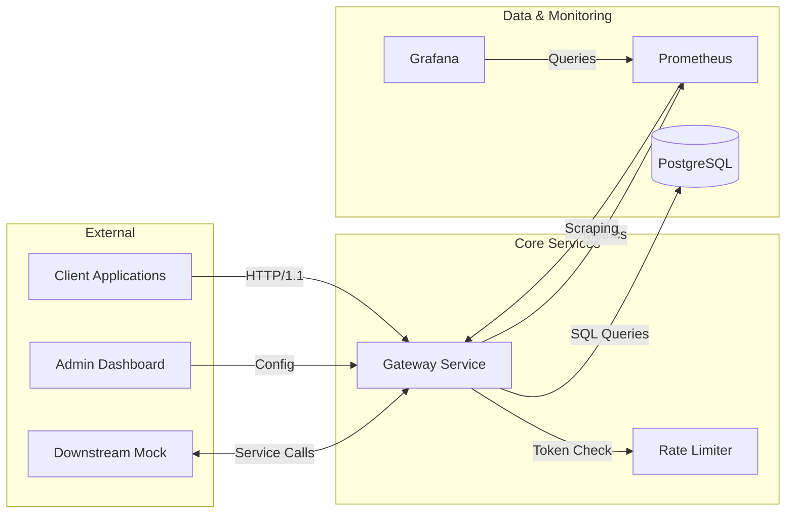

# Gateway Rate Limiter

[](https://github.com/yourorg/gateway-limiter/actions/workflows/ci.yml)
[](https://goreportcard.com/report/github.com/yourorg/gateway-limiter)
[](https://hub.docker.com/r/yourorg/gateway-limiter)
[](https://opensource.org/licenses/MIT)

A production-grade, token bucket-based rate limiting gateway built with Go, featuring distributed rate limiting, real-time metrics, and comprehensive monitoring.

## Table of Contents

- [Architecture](#architecture)
- [Features](#features)
- [Quickstart](#quickstart)
- [Configuration](#configuration)
- [Usage Examples](#usage-examples)
- [API Reference](#api-reference)
- [Development](#development)
- [Deployment](#deployment)
- [Contributing](#contributing)
- [License](#license)

## Architecture



## Features

- **Token Bucket Rate Limiting**: Configurable rates per client/IP
- **Distributed Limiting**: PostgreSQL-backed state for multi-instance deployment
- **Real-time Metrics**: Prometheus-compatible metrics endpoint
- **Health Checks**: Built-in health and readiness probes
- **Docker Native**: Multi-stage builds with distroless images
- **Security**: Non-root execution, static binaries, comprehensive linting
- **Monitoring**: Pre-configured Grafana dashboards and Prometheus alerts

## Quickstart

### Prerequisites

- Docker 24.0+
- Docker Compose V2
- Node.js 20+ (optional, for API testing)

### Installation & Setup

```bash
# Clone the repository
git clone https://github.com/yourorg/gateway-limiter.git
cd gateway-limiter

# Start all services
docker compose up -d --build
```

This starts:
- Gateway service on port `8080`
- PostgreSQL on port `5432`
- Prometheus on port `9090`
- Grafana on port `3000`

### Verify Setup

```bash
# Check service status
docker compose ps

# Test health endpoint
curl -s http://localhost:8080/health | jq

# Access Grafana (default: admin/admin)
open http://localhost:3000
```

## Configuration

### Environment Variables

| Variable | Default | Description | Required |
|----------|---------|-------------|----------|
| `PORT` | `8080` | HTTP server port | Yes |
| `DB_HOST` | `localhost` | PostgreSQL hostname | Yes |
| `DB_PORT` | `5432` | PostgreSQL port | Yes |
| `DB_USER` | `postgres` | PostgreSQL username | Yes |
| `DB_PASSWORD` | `postgres` | PostgreSQL password | Yes |
| `DB_NAME` | `gateway` | PostgreSQL database name | Yes |
| `DB_SSLMODE` | `disable` | PostgreSQL SSL mode | No |
| `RATE_LIMIT` | `100` | Requests per minute per client | No |
| `BURST_SIZE` | `20` | Token bucket burst size | No |
| `LOG_LEVEL` | `info` | Logging level (debug, info, warn, error) | No |
| `METRICS_ENABLED` | `true` | Enable Prometheus metrics endpoint | No |
| `METRICS_PATH` | `/metrics` | Metrics endpoint path | No |
| `CLEANUP_INTERVAL` | `1h` | Cleanup interval for stale tokens | No |

### Rate Limit Configuration

Design custom rate limits per client in `deploy/config/gateway.yml`:

```yaml
rate_limits:
  - client: "premium"
    limit: 1000
    burst: 100
  - client: "standard"
    limit: 100
    burst: 20
  - client: "free"
    limit: 10
    burst: 5
```

## Usage Examples

### Basic Rate Limiting Test

```bash
# Test token bucket exhaustion (expect HTTP 429)
for i in {1..11}; do
  response=$(curl -s -o /dev/null -w "%{http_code}" \
    -H "X-Client-ID: test-client" \
    http://localhost:8080/api/v1/resource)
  echo "Request $i: HTTP $response"
done

# Output:
# Request 1: HTTP 200
# Request 2: HTTP 200
# Request 3: HTTP 200
# Request 4: HTTP 200
# Request 5: HTTP 200
# Request 6: HTTP 200
# Request 7: HTTP 200
# Request 8: HTTP 200
# Request 9: HTTP 200
# Request 10: HTTP 200
# Request 11: HTTP 429
```

### Advanced Rate Limit Testing

```bash
# Test with custom rate limits
curl -s -X POST http://localhost:8080/admin/rate-limit \
  -H "Content-Type: application/json" \
  -d '{"client_id":"premium","limit":1000,"burst":100}'

# Response headers show rate limit info
curl -sv http://localhost:8080/api/v1/resource 2>&1 | grep -i "ratelimit"
# You'll see:
# < X-RateLimit-Limit: 100
# < X-RateLimit-Remaining: 99
# < X-RateLimit-Reset: 60
```

### Monitoring & Metrics

```bash
# Check Prometheus metrics
curl -s http://localhost:8080/metrics | grep gateway_requests_total

# Query Prometheus
curl -s "http://localhost:9090/api/v1/query?query=gateway_requests_total"

# Grafana dashboard
# Navigate to http://localhost:3000
# Login: admin/admin
# Import dashboard from: ./deploy/grafana/dashboards/gateway-overview.json
```

## API Reference

### Core Endpoints

| Method | Endpoint | Description | Auth Required |
|--------|----------|-------------|---------------|
| `GET` | `/health` | Health check probe | No |
| `GET` | `/ready` | Readiness probe | No |
| `GET` | `/metrics` | Prometheus metrics | No |
| `GET` | `/api/v1/config` | Get current config | API Key |
| `PUT` | `/api/v1/config` | Update configuration | API Key |
| `GET` | `/api/v1/stats` | Rate limit statistics | API Key |

### Rate Limit Response Headers

| Header | Description |
|--------|-------------|
| `X-RateLimit-Limit` | Maximum requests per window |
| `X-RateLimit-Remaining` | Requests remaining in window |
| `X-RateLimit-Reset` | Time until window resets |

## 🛠 Development

### Local Development

```bash
# Install dependencies
go mod download

# Run tests
go test -v -race -coverprofile=coverage.out ./...

# Run linter
golangci-lint run

# Run gateway locally
go run ./cmd/gateway -listen :8080
```

### Docker Development

```bash
# Build development image
docker build -t gateway-dev --target builder .

# Run with hot reload
docker run -v $(pwd):/app -p 8080:8080 gateway-dev
```

## Deployment

### Docker Compose (Production)

```bash
# Deploy all services
docker compose -f docker-compose.yml -f docker-compose.prod.yml up -d

# Scale gateway instances
docker compose up -d --scale gateway=3
```

### Kubernetes (Helm)

```bash
# Add Helm chart
helm repo add gateway https://charts.yourorg.com

# Install
helm install gateway gateway/gateway-limiter \
  --set ingress.enabled=true \
  --set postgres.enabled=true \
  --set monitoring.prometheus.enabled=true