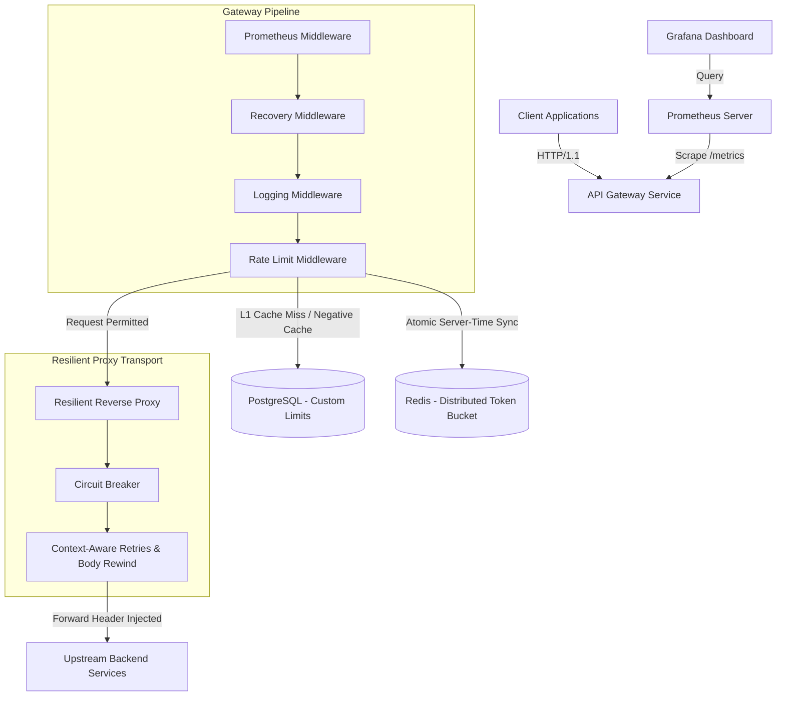

```markdown
# High-Throughput API Gateway & Distributed Rate Limiter

A production-grade, distributed token bucket rate limiting reverse proxy built with Go[cite: 1]. Designed for high-throughput microservices, it features dynamic PostgreSQL limits with L1 in-memory caching, distributed atomic Redis Lua state management with server-side time synchronization, proxy resilience via circuit breakers and backoff retries, RFC 7807 problem details error responses, standard RFC rate limit headers, and complete Prometheus/Grafana observability[cite: 1].

## Architecture & Request Flow



## Key Features & Engineering Highlights

* **Multi-Tiered Rate Limiting:**
* **L1 Cache:** Thread-safe, in-memory TTL map eliminates database roundtrips on hot API routes and supports negative caching to shield against invalid API key floods.


* **L2 Storage:** PostgreSQL persists dynamic, per-client custom rate limit definitions with configurable connection pool bounds.


* **Distributed Synchronization:** Atomic Redis Lua scripts utilize Redis server-side time (`TIME`) to calculate token refills, eliminating host clock drift across multi-instance gateway deployments.


* **Selective Sync Cache:** Middleware deduplicates dynamic quota synchronization to Redis, ensuring `HSET` calls execute only on actual tier modifications.


* **Upstream Resilience & Fault Tolerance:**
* **Circuit Breaker:** State-machine protection (`Closed`, `HalfOpen`, `Open`) preventing cascading failures against degraded upstream services, featuring single-probe canary transitions.


* **Context-Aware Retries:** Automated retries with jitter and request body rewinding for idempotent HTTP methods (`GET`, `HEAD`, `PUT`, `DELETE`), respecting request context cancellation.


* **Socket Protection:** Guarantees proper intermediate response body closure during retry attempts to prevent file descriptor and connection pool leaks.


* **Standards Compliance:**
* **RFC Rate Limit Headers:** Automatically injects `X-RateLimit-Limit`, `X-RateLimit-Remaining`, and `X-RateLimit-Reset` into HTTP responses.


* **RFC 7807 Problem Details:** Emits standard `application/problem+json` payloads for `429`, `500`, `502`, `503`, and `504` errors.


* **Observability & Metrics:** Built-in Prometheus scraping endpoint (`/metrics`) and auto-provisioned Grafana dashboards tracking RPS, Latency (p50/p95/p99), and Drop Rates.


* **Cloud-Native Deployment:** Hardened non-root Distroless Docker images (`gcr.io/distroless/static-debian12`) with zero-dependency Go healthcheck probes (`/app/gateway -healthcheck`).


## Performance Benchmarks

### 1. Go Native Microbenchmarks (`go test -bench`)

> **Hardware Environment:** 12th Gen Intel(R) Core(TM) i7-12700H (20 threads), Windows / AMD64
> **Benchmark Command:** `make benchmark` (`go test -bench=. -benchmem -benchtime=5s ./cmd/api-gateway/`)

| Benchmark Target | Operations | Latency / Op | Memory / Op | Allocations / Op | Throughput / Percentiles |
| --- | --- | --- | --- | --- | --- |
| **Token Bucket Limiter** (`BenchmarkRateLimiter`) | 100,000,000 | 56.43 ns/op | 0 B/op | 0 allocs/op | ~17,720,000 ops/s |
| **Rate Limit Middleware** (`BenchmarkRateLimit`) | 4,979,048 | 1,251 ns/op | 843 B/op | 15 allocs/op | ~799,360 ops/s |
| **Concurrent Load Handler** (`BenchmarkConcurrentLoad`) | 94,486 | 58,200 ns/op | 56,623 B/op | 259 allocs/op | ~17,180 req/s |
| **Composite POST Payload** (`BenchmarkCompositeRequest`) | 86,180 | 65,042 ns/op | 75,944 B/op | 303 allocs/op | ~15,370 req/s |
| **Proxy Throughput Pipeline** (`BenchmarkProxyThroughput`) | 78,873 | 70,190 ns/op | 58,666 B/op | 263 allocs/op | ~14,245 req/s |
| **Latency Percentiles Suite** (`BenchmarkLatencyPercentiles`) | 37,465 | 158,848 ns/op | 52,612 B/op | 259 allocs/op | 6,296 req/s (p50: <0.01ms, p95: 1.00ms, p99: 1.03ms) |

### 2. End-to-End Distributed Load Testing (`k6`)

> **Workload Profile:** 4 scenarios (`ramp_up`, `sustained_load`, `spike` up to 400 VUs, `stress` arrival rate to 2,000 iters/s) over 4m30s against Docker Compose gateway stack.
>
>

```
=== High-Throughput API Gateway Load Test Results ===

Overall Metrics:
  HTTP Requests: 429,186
  Request Rate: 1,589.47 req/s
  Success Rate: 100.00%
  Failed Requests: 0 (0.00%)
  Dropped Iterations: 0 (0.00/s)

Latency Percentiles:
  P50: 21.98 ms
  P90: 41.18 ms
  P95: 45.70 ms
  Max Latency: 143.36 ms

Scenario Breakdown:
  ramp_up        [000/200 VUs]  2m0s  (P95: 4.39ms)
  sustained_load [200 VUs]       30s  (P95: 8.33ms)
  spike          [000/400 VUs]   40s  (P95: 47.56ms)
  stress         [000/106 VUs]  1m0s  (P95: 2.63ms, 1999.98 iters/s)

Checks:
  status is 2xx or 429: 429,183 passes, 0 fails
  response time < 1s:   429,183 passes, 0 fails

```

## Quickstart

### 1. Launch Infrastructure

```bash
# Start Gateway, PostgreSQL, Redis, Prometheus, and Grafana
docker compose up -d --build

```

### 2. Service Endpoints

* **Gateway Service:** `http://localhost:8080`

* **Healthcheck Probe:** `http://localhost:8080/healthz`

* **Readiness Probe:** `http://localhost:8080/readyz`

* **Prometheus Metrics:** `http://localhost:8080/metrics`

* **Grafana Dashboard:** `http://localhost:3000` *(Default credentials: `admin` / `admin`)*


## Usage & API Responses

### Test Rate Limiting

```bash
curl -i -H "X-API-Key: test-api-key" http://localhost:8080/anything/data

```

**Standard Response Headers:**

```http
HTTP/1.1 200 OK
X-Gateway: go-limiter
X-RateLimit-Limit: 10000
X-RateLimit-Remaining: 9999
X-RateLimit-Reset: 1

```

**Rate Limit Exceeded (`HTTP 429 - RFC 7807`):**

```json
{
  "type": "[https://tools.ietf.org/html/rfc6585#section-4](https://tools.ietf.org/html/rfc6585#section-4)",
  "title": "Too Many Requests",
  "status": 429,
  "detail": "Rate limit quota exceeded. Try again in 1 second.",
  "instance": "/anything/data"
}

```

## License

Distributed under the MIT License.