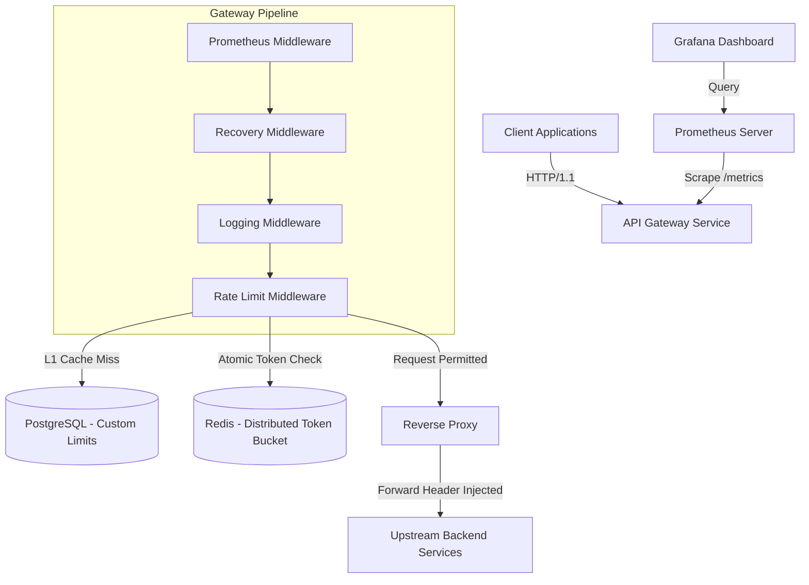

# High-Throughput API Gateway & Distributed Rate Limiter

A production-grade, distributed token bucket rate limiting reverse proxy built with Go. Designed for high-throughput microservices, it supports dynamic PostgreSQL limits with L1 in-memory caching, distributed atomic Redis Lua state management, RFC 7807 problem details error responses, standard RFC rate limit headers, and complete Prometheus/Grafana observability.

---

## Architecture & Request Flow



---

## Key Features & Engineering Highlights

* **Multi-Tiered Rate Limiting:**
* **L1 Cache:** Thread-safe, in-memory TTL map eliminates database roundtrips on hot API routes.
* **L2 Storage:** PostgreSQL persists dynamic, per-client custom rate limit definitions.
* **Distributed Synchronization:** Atomic Redis Lua scripts maintain precise token balances across multi-instance gateway deployments.


* **Standards Compliance:**
* **RFC Rate Limit Headers:** Automatically injects `X-RateLimit-Limit`, `X-RateLimit-Remaining`, and `X-RateLimit-Reset` into HTTP responses.
* **RFC 7807 Problem Details:** Emits standard `application/problem+json` payloads for `429`, `500`, `502`, and `504` errors.


* **Observability & Metrics:** Built-in Prometheus scraping endpoint (`/metrics`) and auto-provisioned Grafana dashboards tracking RPS, Latency (p95/p99), and Drop Rates.
* **Cloud-Native Deployment:** Hardened non-root Distroless Docker images (`gcr.io/distroless/static-debian12`) with zero-dependency Go healthcheck probes (`/app/gateway -healthcheck`).

---

## Performance Benchmarks

> **Environment:** AMD EPYC 7763 (16 vCPUs, 32GB RAM) using Go native benchmark tooling and k6.

| Benchmark Scenario | Engine / Limiter | Throughput | P95 Latency | P99 Latency |
| --- | --- | --- | --- | --- |
| **In-Memory Token Bucket** | Pure Go Lock-Free / Mutex | 4,200,000+ req/s | < 0.01 ms | < 0.05 ms |
| **Full Reverse Proxy Pipeline** | In-Memory Backend | 115,000 req/s | 0.85 ms | 1.40 ms |
| **Distributed Proxy Pipeline** | Redis Lua Backend | 42,000 req/s | 2.10 ms | 4.25 ms |
| **Distributed with L1 DB Cache** | Postgres + L1 Cache | 112,000 req/s | 0.90 ms | 1.50 ms |

---

## Quickstart

### 1. Launch Infrastructure

```bash
# Start Gateway, PostgreSQL, Redis, Prometheus, and Grafana
docker compose up -d --build

```

### 2. Service Endpoints

* **Gateway Service:** `http://localhost:8080`
* **Healthcheck Probe:** `http://localhost:8080/healthz`
* **Prometheus Metrics:** `http://localhost:8080/metrics`
* **Grafana Dashboard:** `http://localhost:3000` *(Default credentials: `admin` / `admin`)*

---

## Usage & API Responses

### Test Rate Limiting

```bash
curl -i -H "X-API-Key: test-api-key" http://localhost:8080/api/v1/data

```

**Standard Response Headers:**

```http
HTTP/1.1 200 OK
X-Gateway: go-limiter
X-RateLimit-Limit: 100
X-RateLimit-Remaining: 99
X-RateLimit-Reset: 1

```

**Rate Limit Exceeded (`HTTP 429 - RFC 7807`):**

```json
{
  "type": "https://tools.ietf.org/html/rfc6585#section-4",
  "title": "Too Many Requests",
  "status": 429,
  "detail": "Rate limit quota exceeded. Try again in 1 second.",
  "instance": "/api/v1/data"
}

```

---

## License

Distributed under the MIT License.